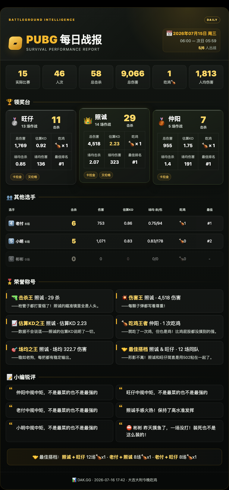

# PUBG 每日战报



## 使用

```bash
make install
make fetch
make report
```

开发检查：

```bash
make dev
make check
```

历史报告：

```bash
make report DAYS_AGO=2
```

服务器没有 Chrome 时可以只生成 HTML：

```bash
make report NO_SCREENSHOT=1
```

运行 `make help` 可以查看全部目标；`make daily` 会依次抓取数据并生成昨天的报告。

## 结构

- `fetch_data.py`：调用 DAK.GG 页面使用的 JSON API 抓取数据，并写入 `data/fetch_manifest.json` 固定抓取时间和有效分页。
- `pubg_report/parser.py`：解析 DAK.GG 文本。
- `pubg_report/stats.py`：玩家统计及比赛维度去重。
- `pubg_report/awards.py`：确定性称号和评语。
- `pubg_report/renderer.py`：渲染独立 HTML。
- `pubg_report/templates/`、`pubg_report/static/`：HTML 模板和样式。
- `pubg_report/screenshot.py`：Chrome 截图。
- `pubg_report/pipeline.py`：主流程和文件输出。
- `tests/`：解析、统计、数据清单和 HTML 安全测试。

报告中的“实际比赛”和“吃鸡”按去重后的比赛计算；“人次”是所有玩家的比赛记录之和。“估算KD”不包含助攻，因此不再标记为 KDA。
